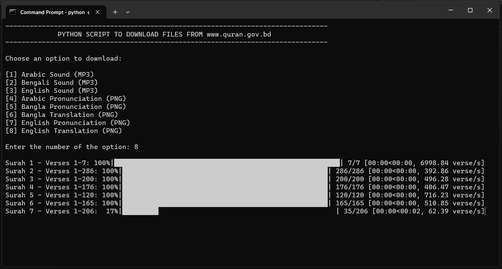

<h1 align="center">Quran Files Download Script</h1>

<p align="center">This Python script allows you to download audio and image files of the Quran from www.quran.gov.bd</p>
<p align="center"></p>
<p align="center"><caption>A screenshot showing the script is executing in command prompt.</caption></p><hr>

## Prerequisites

Before running the script, ensure you have the following:

1. **Python**: Make sure you have Python installed on your system. You can download it from the official Python website: [Python Downloads](https://www.python.org/downloads/).

2. **Required Libraries**: Install the necessary Python libraries using pip (Python package manager). Open your terminal/command prompt and run the following command:
   ```bash
   pip install requests tqdm

## Usage

1. **Download the script**:
   - Download the script file (`download_quran.py`) from this repo or copy the [following code](https://github.com/nishatrhythm/Python-File-Scrapper?tab=readme-ov-file#scrapper), paste in Notepad and save it to your local machine as `download_quran.py`.

2. **Run the script**:
   - Open your terminal/command prompt.
   - Navigate to the directory where the script is located.
   - Execute the script using the following command:
     ```bash
     python download_quran.py
     ```

3. **Choose an option**:
   - You will be prompted to choose an option from the following:
     - [1] Arabic Sound (MP3)
     - [2] Bengali Sound (MP3)
     - [3] English Sound (MP3)
     - [4] Arabic Pronunciation (PNG)
     - [5] Bangla Pronunciation (PNG)
     - [6] Bangla Translation (PNG)
     - [7] English Pronunciation (PNG)
     - [8] English Translation (PNG)

4. **Download and Enjoy**:
   - The script will download the selected files and display the download progress.

## Known Issues

I am aware of the following issues, but no fix will be provided.

1. Two (2) image files are missing for this two (2) URLs.
   - [http://www.quran.gov.bd/quran/bengaliT/62/62-3.png](http://www.quran.gov.bd/quran/bengaliT/62/62-3.png)
   - [http://www.quran.gov.bd/quran/bengaliT/62/62-4.png](http://www.quran.gov.bd/quran/bengaliT/62/62-4.png)
2. The script may pause or experience interruptions because of occasional unresponsiveness from the server. I have thoroughly tested the script, and there are no issues with the script itself.

## Scrapper

```python
import requests
import os
from tqdm import tqdm
import time

# Clear the screen and set the CMD window title
os.system("cls" if os.name == "nt" else "clear")

# Display the centered title
title = "PYTHON SCRIPT TO DOWNLOAD FILES FROM www.quran.gov.bd"
print("-" * 80)
print(title.center(80))
print("-" * 80)

# Define the base URLs for the different options
base_urls = {
    "Arabic": "http://www.quran.gov.bd/quran/Sound/arabic/",
    "Bangla": "http://www.quran.gov.bd/quran/Sound/bangla/",
    "English": "http://www.quran.gov.bd/quran/Sound/english/",

    "ArabicP": "http://www.quran.gov.bd/quran/arabic/",
    "BanglaP": "http://www.quran.gov.bd/quran/bengaliP/",
    "BanglaT": "http://www.quran.gov.bd/quran/bengaliT/",
    "EnglishP": "http://www.quran.gov.bd/quran/englishP/",
    "EnglishT": "http://www.quran.gov.bd/quran/englishT/"
}

# Define the number of Surahs and verses
total_surahs = 114
total_verses_per_surah = [
    7, 286, 200, 176, 120, 165, 206, 75, 129, 109,
    123, 111, 43, 52, 99, 128, 111, 110, 98, 135,
    112, 78, 118, 64, 77, 227, 93, 88, 69, 60,
    34, 30, 73, 54, 45, 83, 182, 88, 75, 85, 54,
    53, 89, 59, 37, 35, 38, 29, 18, 45, 60, 49,
    62, 55, 78, 96, 29, 22, 24, 13, 14, 11, 11,
    18, 12, 12, 30, 52, 52, 44, 28, 28, 20, 56,
    40, 31, 50, 40, 46, 42, 29, 19, 36, 25, 22,
    17, 19, 26, 30, 20, 15, 21, 11, 8, 8, 19,
    5, 8, 8, 11, 11, 8, 3, 9, 5, 4, 7, 3,
    6, 3, 5, 4, 5, 6
]

# Special file names for Bismillahir Rahmanir Rahim
bismillah_files = {
    "Arabic": "1/1-0.mp3",
    "Bangla": "1/1-0.mp3",
    "English": "1/1-0.mp3",

    "ArabicP": "1/1-0.png",
    "BanglaP": "1/1-0.png",
    "BanglaT": "1/1-0.png",
    "EnglishP": "1/1-0.png",
    "EnglishT": "1/1-0.png"
}

# Define a function to download a file with retries
def download_with_retry(url, file_path, max_retries=3):
    for _ in range(max_retries):
        response = requests.get(url)
        if response.status_code == 200:
            with open(file_path, 'wb') as file:
                file.write(response.content)
            return True
        else:
            print(f"Failed to download {url}. Retrying...")
            time.sleep(1)  # Wait for a second before retrying
    return False

# Function to calculate the progress of a folder
def calculate_folder_progress(folder_path):
    existing_files = [f for f in os.listdir(folder_path) if os.path.isfile(os.path.join(folder_path, f))]
    return len(existing_files)

# Prompt the user to choose an option
print("\nChoose an option to download:\n")
print("[1] Arabic Sound (MP3)")
print("[2] Bengali Sound (MP3)")
print("[3] English Sound (MP3)")
print("[4] Arabic Pronunciation (PNG)")
print("[5] Bangla Pronunciation (PNG)")
print("[6] Bangla Translation (PNG)")
print("[7] English Pronunciation (PNG)")
print("[8] English Translation (PNG)\n")
choice = input("Enter the number of the option: ")

# Validate the user's choice
if choice not in ["1", "2", "3", "4", "5", "6", "7", "8"]:
    print("Invalid choice. Please enter between 1 to 8.")
else:
    option = ["Arabic", "Bangla", "English", "ArabicP", "BanglaP", "BanglaT", "EnglishP", "EnglishT"][int(choice) - 1]
    print("")

    # Create a directory to save the files
    download_folder = os.path.join("Quran Files", option)
    if not os.path.exists(download_folder):
        os.makedirs(download_folder)

    # Check if Bismillahir Rahmanir Rahim file (MP3 or PNG) already exists
    if choice in ["1", "2", "3"]:
        bismillah_file_extension = "mp3"
    else:
        bismillah_file_extension = "png"

    bismillah_file_path = os.path.join(download_folder, f"1-0.{bismillah_file_extension}")
    if not os.path.exists(bismillah_file_path):
        url = f"{base_urls[option]}{bismillah_files[option]}"
        if download_with_retry(url, bismillah_file_path):
            print(f"Downloaded Bismillahir Rahmanir Rahim for ({option})")
        else:
            print(f"Failed to download Bismillahir Rahmanir Rahim for ({option}).")


    # Loop through all the Surahs and verses for the chosen option
    file_extension = "mp3" if choice in ["1", "2", "3"] else "png"
    for surah in range(1, total_surahs + 1):
        surah_folder = os.path.join(download_folder, str(surah))
        if not os.path.exists(surah_folder):
            os.makedirs(surah_folder)

        verse_range = f"Verses 1-{total_verses_per_surah[surah - 1]}"
        with tqdm(total=total_verses_per_surah[surah - 1], position=0, leave=True, desc=f"Surah {surah} - {verse_range}", unit=' verse') as pbar:
            for verse in range(1, total_verses_per_surah[surah - 1] + 1):
                url = f"{base_urls[option]}{surah}/{surah}-{verse}.{file_extension}"
                file_name = os.path.join(surah_folder, f"{surah}-{verse}.{file_extension}")
                if not os.path.exists(file_name):
                    if download_with_retry(url, file_name):
                        pbar.update(1)  # Successfully downloaded
                pbar.n = calculate_folder_progress(surah_folder)

    print(f"Download of {option} ({file_extension.upper()}) completed.")
```
